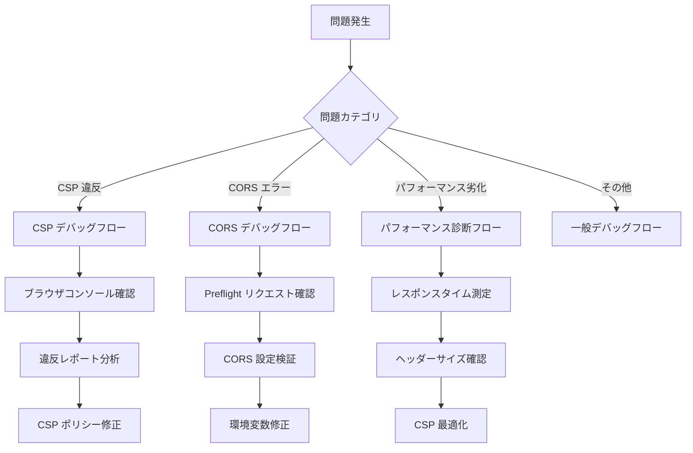

# セキュリティヘッダー トラブルシューティングガイド

## 目次
- [概要](#概要)
- [よくある問題と解決策](#よくある問題と解決策)
- [CSP 違反のデバッグ方法](#csp-違反のデバッグ方法)
- [CORS エラーのトラブルシューティング](#cors-エラーのトラブルシューティング)
- [パフォーマンス問題の診断](#パフォーマンス問題の診断)
- [デバッグツール](#デバッグツール)
- [FAQ](#faq)

---

## 概要

本ガイドは、セキュリティヘッダー実装における一般的な問題、デバッグ方法、解決策を提供します。

### トラブルシューティングフロー



---

## よくある問題と解決策

### 問題1: Next.js 開発サーバーで画面が真っ白になる

**症状**:
- Next.js `npm run dev` 起動後、ブラウザで画面が表示されない
- ブラウザコンソールに CSP 違反エラーが大量に表示される

```
Refused to execute inline script because it violates the following Content Security Policy directive: "script-src 'self'".
```

**原因**:
Next.js 開発モードは Hot Module Replacement (HMR) で `eval()` を使用するため、`script-src 'self'` だけでは動作しない。

**解決策**:

開発環境で `'unsafe-eval'` と `'unsafe-inline'` を許可する:

```typescript
// frontend/security-config.ts
export function getSecurityConfig(isDev: boolean): SecurityConfig {
  return {
    csp: {
      scriptSrc: isDev
        ? ["'self'", "'unsafe-eval'", "'unsafe-inline'"] // 開発環境
        : ["'self'"], // 本番環境
      // ...
    },
  };
}
```

**検証**:
```bash
# ブラウザで http://localhost:13001 にアクセス
# コンソールエラーがないことを確認
```

---

### 問題2: Laravel API で CSP ヘッダーが付与されない

**症状**:
- `curl -I http://localhost:13000/api/health` を実行してもCSPヘッダーが表示されない
- E2E テストで CSP テストが失敗する

**原因1**: CSP が環境変数で無効化されている

**解決策1**:
```bash
# .env 確認
cat backend/laravel-api/.env | grep SECURITY_ENABLE_CSP

# SECURITY_ENABLE_CSP=false の場合、true に変更
SECURITY_ENABLE_CSP=true
```

**原因2**: SecurityHeaders ミドルウェアが登録されていない

**解決策2**:
```php
// backend/laravel-api/bootstrap/app.php 確認
use App\Http\Middleware\SecurityHeaders;

return Application::configure(basePath: dirname(__DIR__))
    ->withMiddleware(function (Middleware $middleware) {
        $middleware->api(append: [
            SecurityHeaders::class, // この行が存在するか確認
        ]);
    })
    ->create();
```

**原因3**: ミドルウェアの処理順序が誤っている (CORS より前に実行されている)

**解決策3**:
```php
// SecurityHeaders を CORS の後に配置 (append で追加)
$middleware->api(append: [
    SecurityHeaders::class, // 正しい位置
]);

// ❌ 誤り: prepend で追加すると CORS より前に実行される
$middleware->api(prepend: [
    SecurityHeaders::class, // これは誤り
]);
```

**検証**:
```bash
curl -I http://localhost:13000/api/health | grep -i "content-security-policy"
# Content-Security-Policy-Report-Only: ... が表示されることを確認
```

---

### 問題3: Admin App で iframe 埋め込みができない

**症状**:
- Admin App を iframe で埋め込もうとすると空白になる
- ブラウザコンソールエラー:

```
Refused to display 'http://localhost:13002' in a frame because it set 'X-Frame-Options' to 'DENY'.
```

**原因**:
Admin App は `X-Frame-Options: DENY` で iframe 埋め込みを完全拒否している (仕様)。

**解決策**:

Admin App は管理画面であり、iframe 埋め込みは**セキュリティリスク**のため推奨されない。

**代替案1**: User App を使用する (User App は `X-Frame-Options: SAMEORIGIN` で同一オリジン許可)

**代替案2**: どうしても Admin App を iframe で使用したい場合 (非推奨):

```typescript
// frontend/admin-app/next.config.ts
{
  key: 'X-Frame-Options',
  value: 'SAMEORIGIN', // DENY から変更
}
```

⚠️ **警告**: Admin App の `X-Frame-Options: DENY` を変更すると、クリックジャッキング攻撃のリスクが増大します。本番環境では**絶対に**変更しないでください。

---

### 問題4: HSTS ヘッダーがローカル開発環境で付与されない

**症状**:
- `curl -I http://localhost:13000/api/health` で HSTS ヘッダーが表示されない

**原因**:
HSTS は HTTPS 環境でのみ有効化される (HTTP では無意味)。

**解決策**:

これは**正常な動作**です。HSTS は `$request->secure()` が `true` の場合 (HTTPS) のみ付与されます。

```php
// SecurityHeaders.php
if ($request->secure() && config('security.force_hsts')) {
    // HTTPS環境のみ HSTS ヘッダー付与
}
```

ローカルで HSTS をテストしたい場合:

1. **mkcert でローカル HTTPS 化**:
```bash
# mkcert インストール
brew install mkcert

# ローカル CA 証明書生成
mkcert -install

# localhost 証明書生成
mkcert localhost 127.0.0.1 ::1

# Laravel サーバー起動 (HTTPS)
php artisan serve --host=0.0.0.0 --port=13000 --ssl
```

2. **環境変数で HSTS 有効化**:
```bash
SECURITY_FORCE_HSTS=true
```

---

### 問題5: Google Analytics が CSP でブロックされる

**症状**:
- Google Analytics スクリプトが読み込まれない
- ブラウザコンソールエラー:

```
Refused to load the script 'https://www.google-analytics.com/analytics.js' because it violates the following Content Security Policy directive: "script-src 'self'".
```

**原因**:
CSP `script-src 'self'` で外部スクリプトが拒否されている。

**解決策**:

Google Analytics ドメインを CSP に追加:

**Laravel API**:
```bash
# .env
SECURITY_CSP_SCRIPT_SRC='self' https://www.google-analytics.com https://www.googletagmanager.com
SECURITY_CSP_CONNECT_SRC='self' https://www.google-analytics.com
```

**Next.js**:
```typescript
// frontend/security-config.ts
export function getSecurityConfig(isDev: boolean): SecurityConfig {
  return {
    csp: {
      scriptSrc: [
        "'self'",
        'https://www.google-analytics.com',
        'https://www.googletagmanager.com',
      ],
      connectSrc: [
        "'self'",
        'https://www.google-analytics.com',
        apiUrl,
      ],
      // ...
    },
  };
}
```

**検証**:
```bash
# ブラウザで Network タブを開き、analytics.js が読み込まれることを確認
```

---

### 問題6: Stripe.js 決済ライブラリが CSP でブロックされる

**症状**:
- Stripe 決済フォームが表示されない
- ブラウザコンソールエラー:

```
Refused to load the script 'https://js.stripe.com/v3/' because it violates the following Content Security Policy directive: "script-src 'self'".
```

**原因**:
Stripe.js が外部ドメインからスクリプトを読み込むため。

**解決策**:

Stripe 推奨 CSP 設定を追加:

```typescript
// frontend/security-config.ts
export function getSecurityConfig(isDev: boolean): SecurityConfig {
  return {
    csp: {
      scriptSrc: [
        "'self'",
        'https://js.stripe.com',
      ],
      frameSrc: [
        'https://js.stripe.com',
        'https://hooks.stripe.com',
      ],
      connectSrc: [
        "'self'",
        'https://api.stripe.com',
        apiUrl,
      ],
      // ...
    },
  };
}
```

**参考**: [Stripe CSP ガイド](https://stripe.com/docs/security/guide#content-security-policy)

---

## CSP 違反のデバッグ方法

### ステップ1: ブラウザコンソールで違反を確認

1. **Chrome DevTools を開く**: `F12` または `Cmd+Option+I`
2. **Console タブを選択**
3. **CSP 違反エラーを確認**:

```
[Report Only] Refused to execute inline script because it violates the following Content Security Policy directive: "script-src 'self'". Either the 'unsafe-inline' keyword, a hash ('sha256-...'), or a nonce ('nonce-...') is required to enable inline execution.
```

**重要な情報**:
- `[Report Only]`: Report-Only モード (違反は記録されるが実行は許可される)
- `Refused to execute inline script`: インラインスクリプトがブロックされた
- `"script-src 'self'"`: 違反したディレクティブ
- `'unsafe-inline' keyword`: 解決策のヒント

### ステップ2: Network タブで Preflight リクエストを確認

CSP 違反がリソース読み込みに関連する場合:

1. **Network タブを開く**
2. **失敗したリクエストを確認** (赤色表示)
3. **Headers タブで CSP ヘッダーを確認**:

```
Content-Security-Policy-Report-Only: script-src 'self'; ...
```

### ステップ3: CSP 違反レポートを確認

**Laravel セキュリティログ**:
```bash
tail -f backend/laravel-api/storage/logs/security.log
```

**ログエントリー例**:
```json
{
  "blocked_uri": "https://example.com/malicious.js",
  "violated_directive": "script-src",
  "document_uri": "https://app.example.com/page",
  "source_file": "https://app.example.com/page",
  "line_number": 42
}
```

**分析ポイント**:
- `blocked_uri`: ブロックされたリソース (正当か不正か判断)
- `violated_directive`: どのディレクティブが違反したか
- `source_file`, `line_number`: 違反発生箇所

### ステップ4: CSP ポリシーを修正

**違反タイプ別の修正方法**:

| 違反内容 | 修正方法 |
|----------|----------|
| 外部スクリプト読み込み | `script-src` にドメイン追加 |
| インラインスクリプト | `'unsafe-inline'` 追加 (非推奨) または nonce/hash 使用 |
| WebSocket 接続 | `connect-src` に `ws:` `wss:` 追加 |
| 外部画像読み込み | `img-src` にドメイン追加 |
| iframe 埋め込み | `frame-src` にドメイン追加 |

### ステップ5: CSP Evaluator でポリシーを検証

**Google CSP Evaluator**: https://csp-evaluator.withgoogle.com/

1. CSP ポリシー文字列をコピー
2. CSP Evaluator に貼り付け
3. セキュリティ警告を確認
4. 推奨事項に従ってポリシー改善

---

## CORS エラーのトラブルシューティング

### エラー1: CORS policy: No 'Access-Control-Allow-Origin' header

**ブラウザコンソールエラー**:
```
Access to fetch at 'http://localhost:13000/api/health' from origin 'http://localhost:13001' has been blocked by CORS policy: No 'Access-Control-Allow-Origin' header is present on the requested resource.
```

**原因**:
フロントエンドオリジンが Laravel CORS 許可リストに含まれていない。

**デバッグステップ**:

1. **CORS 設定確認**:
```bash
cd backend/laravel-api
cat .env | grep CORS_ALLOWED_ORIGINS
```

2. **期待値と比較**:
```bash
# User App からのリクエストの場合
CORS_ALLOWED_ORIGINS=http://localhost:13001,http://localhost:13002
```

3. **CORS 検証スクリプト実行**:
```bash
bash scripts/validate-cors-config.sh
```

**解決策**:
```bash
# .env
CORS_ALLOWED_ORIGINS=http://localhost:13001,http://localhost:13002,http://127.0.0.1:13001,http://127.0.0.1:13002
```

### エラー2: CORS policy: The value of the 'Access-Control-Allow-Credentials' header is ''

**ブラウザコンソールエラー**:
```
Access to fetch at 'http://localhost:13000/api/login' from origin 'http://localhost:13001' has been blocked by CORS policy: The value of the 'Access-Control-Allow-Credentials' header in the response is '' which must be 'true' when the request's credentials mode is 'include'.
```

**原因**:
フロントエンドが `credentials: 'include'` でリクエストしているが、Laravel が `Access-Control-Allow-Credentials: true` を返していない。

**解決策**:
```bash
# .env
CORS_SUPPORTS_CREDENTIALS=true
```

**検証**:
```bash
curl -I -H "Origin: http://localhost:13001" http://localhost:13000/api/health | grep -i "access-control-allow-credentials"
# Access-Control-Allow-Credentials: true が表示されることを確認
```

### エラー3: CORS と CSP の競合

**症状**:
- CORS Preflight リクエストは成功する
- しかし、実際のリクエストが CSP でブロックされる

**ブラウザコンソールエラー**:
```
Refused to connect to 'http://localhost:13000/api/health' because it violates the following Content Security Policy directive: "connect-src 'self'".
```

**原因**:
CSP `connect-src` に API ドメインが含まれていない。

**解決策**:

**Laravel API**:
```bash
# .env
SECURITY_CSP_CONNECT_SRC='self' http://localhost:13001 http://localhost:13002
```

**Next.js**:
```typescript
// frontend/security-config.ts
connectSrc: isDev
  ? ["'self'", 'ws:', 'wss:', 'http://localhost:13000']
  : ["'self'", 'https://api.example.com'],
```

### CORS デバッグチェックリスト

- [ ] `CORS_ALLOWED_ORIGINS` に正しいオリジンが含まれているか
- [ ] `CORS_SUPPORTS_CREDENTIALS` が `true` か (Cookie 送信時)
- [ ] CSP `connect-src` に API ドメインが含まれているか
- [ ] CORS ミドルウェアが SecurityHeaders ミドルウェアより**前**に実行されているか
- [ ] Preflight リクエスト (OPTIONS) が成功しているか (Network タブ確認)
- [ ] 本番環境で `CORS_ALLOWED_ORIGINS=*` を使用していないか (セキュリティリスク)

---

## パフォーマンス問題の診断

### 問題: セキュリティヘッダー追加後、レスポンスタイムが遅くなった

**診断ステップ**:

#### 1. レスポンスタイム測定

**Apache Bench でベンチマーク**:
```bash
# セキュリティヘッダー無効化
ab -n 1000 -c 10 http://localhost:13000/api/health

# セキュリティヘッダー有効化
ab -n 1000 -c 10 http://localhost:13000/api/health
```

**比較項目**:
- `Time per request` (平均レスポンスタイム)
- `Requests per second` (スループット)

**許容範囲**:
- レスポンスタイム増加 < 5ms
- スループット低下 < 5%

#### 2. ヘッダーサイズ測定

```bash
# ヘッダーサイズ確認
curl -I http://localhost:13000/api/health | wc -c

# 期待値: < 1KB (1024 bytes)
```

**大きすぎる場合の原因**:
- CSP ポリシーが冗長 (不要なドメインが多数含まれている)
- 環境変数で重複設定している

**解決策**:
CSP ポリシーを最適化:
```bash
# Before (冗長)
SECURITY_CSP_SCRIPT_SRC='self' https://cdn1.com https://cdn2.com https://cdn3.com https://cdn4.com ...

# After (最小化)
SECURITY_CSP_SCRIPT_SRC='self' https://*.cdn.com
```

#### 3. ミドルウェア実行時間測定

**Laravel Telescope を使用**:
```bash
composer require laravel/telescope --dev
php artisan telescope:install
php artisan migrate
```

**Telescope ダッシュボードで確認**:
1. `http://localhost:13000/telescope` にアクセス
2. **Requests タブ** を選択
3. SecurityHeaders ミドルウェアの実行時間を確認

**期待値**: < 1ms

#### 4. CSP 構築処理の最適化

**問題**: CSP ポリシー構築処理が遅い (複雑な文字列結合)

**解決策**: CSP ポリシーをキャッシュする

```php
// app/Http/Middleware/SecurityHeaders.php
private function buildCspPolicy(): string
{
    return cache()->remember('csp_policy', 3600, function () {
        // CSP ポリシー構築ロジック
        $directives = [/* ... */];
        return implode('; ', $directives);
    });
}
```

---

## デバッグツール

### 1. ブラウザ開発者ツール

#### Chrome DevTools
- **Console**: CSP 違反エラー表示
- **Network**: リクエスト/レスポンスヘッダー確認
- **Security**: セキュリティ概要、証明書確認
- **Application > Storage**: HSTS 状態確認

#### Firefox Developer Tools
- **コンソール**: CSP 違反詳細表示 (Chrome より詳細)
- **ネットワーク**: CORS Preflight リクエスト確認

### 2. コマンドラインツール

#### curl - ヘッダー確認
```bash
# レスポンスヘッダーのみ表示
curl -I http://localhost:13000/api/health

# 特定ヘッダーのみ抽出
curl -I http://localhost:13000/api/health | grep -i "content-security-policy"

# CORS Preflight シミュレーション
curl -X OPTIONS \
  -H "Origin: http://localhost:13001" \
  -H "Access-Control-Request-Method: GET" \
  http://localhost:13000/api/health
```

#### httpie - 見やすい HTTP クライアント
```bash
# インストール
brew install httpie

# 使用例
http http://localhost:13000/api/health
```

### 3. オンラインツール

#### Security Headers Scanner
URL: https://securityheaders.com/

**使い方**:
1. 本番 URL を入力
2. スキャン実行
3. セキュリティヘッダーのスコアを確認 (A+ が最高)

#### CSP Evaluator (Google)
URL: https://csp-evaluator.withgoogle.com/

**使い方**:
1. CSP ポリシー文字列を貼り付け
2. 評価結果を確認
3. セキュリティ警告を修正

#### Mozilla Observatory
URL: https://observatory.mozilla.org/

**使い方**:
1. 本番 URL を入力
2. 総合セキュリティスコアを確認
3. 推奨事項に従って改善

---

## FAQ

### Q1: CSP Report-Only モードと Enforce モードの違いは？

**A1**:

| モード | ヘッダー名 | 動作 | 用途 |
|--------|-----------|------|------|
| Report-Only | `Content-Security-Policy-Report-Only` | 違反を**記録のみ**、実行は許可 | 段階的導入、ポリシー調整 |
| Enforce | `Content-Security-Policy` | 違反を**ブロック**、実行拒否 | 本番環境 (調整完了後) |

**推奨フロー**:
1. Report-Only で 1 週間運用
2. 違反レポート分析・ポリシー調整
3. 違反率 < 0.1% を確認
4. Enforce モードに切り替え

---

### Q2: 本番環境で CSP を緊急無効化する方法は？

**A2**:

**即座実行** (5分以内):
```bash
# .env
SECURITY_ENABLE_CSP=false

# デプロイ
# または環境変数を動的に更新 (Kubernetes/Docker環境)
kubectl set env deployment/laravel-api SECURITY_ENABLE_CSP=false
```

**ロールバック後**:
1. 根本原因調査 (CSP ポリシーの問題箇所特定)
2. 修正実装
3. ステージング環境で検証
4. 再度 Report-Only モードから段階的導入

---

### Q3: HSTS を有効化したが、ブラウザが HTTP にアクセスし続ける

**A3**:

**原因**:
- ブラウザが HSTS を記憶するには、**一度 HTTPS でアクセス**する必要がある
- HTTP でアクセスした後に HSTS ヘッダーを返しても、次回以降にしか適用されない

**解決策**:
1. ユーザーに HTTPS URL を直接提供 (`https://app.example.com`)
2. HTTP → HTTPS リダイレクトを設定 (Nginx/Apache)
3. HSTS Preload リストに登録 (永続的解決策)

**HSTS Preload 登録**:
1. https://hstspreload.org/ にアクセス
2. ドメインを入力
3. 要件を満たす (`max-age >= 31536000`, `includeSubDomains`, `preload`)
4. 申請提出 (Chrome/Firefox/Safari に事前登録)

---

### Q4: Next.js の Turbopack で CSP 違反が発生する

**A4**:

**原因**:
Turbopack は `eval()` を使用するため、`'unsafe-eval'` が必要。

**解決策**:
開発環境のみ `'unsafe-eval'` 許可:

```typescript
// frontend/security-config.ts
scriptSrc: isDev
  ? ["'self'", "'unsafe-eval'", "'unsafe-inline'"]
  : ["'self'"],
```

**本番環境では絶対に `'unsafe-eval'` を使用しない**こと。

---

### Q5: Docker 環境で CORS が動作しない

**A5**:

**原因**:
Docker 内部の `localhost` と ホストマシンの `localhost` は異なる。

**解決策**:
Docker Compose で `host.docker.internal` を使用:

```bash
# .env (Docker 環境)
CORS_ALLOWED_ORIGINS=http://host.docker.internal:13001,http://host.docker.internal:13002
```

または Docker ネットワーク内のサービス名を使用:

```bash
# docker-compose.yml でサービス名が user-app の場合
CORS_ALLOWED_ORIGINS=http://user-app:13001,http://admin-app:13002
```

---

**作成日**: 2025-10-18
**最終更新日**: 2025-10-18
**バージョン**: 1.0.0
