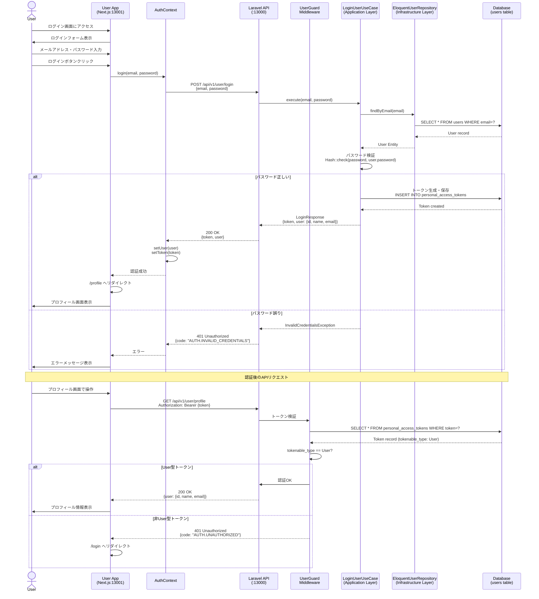
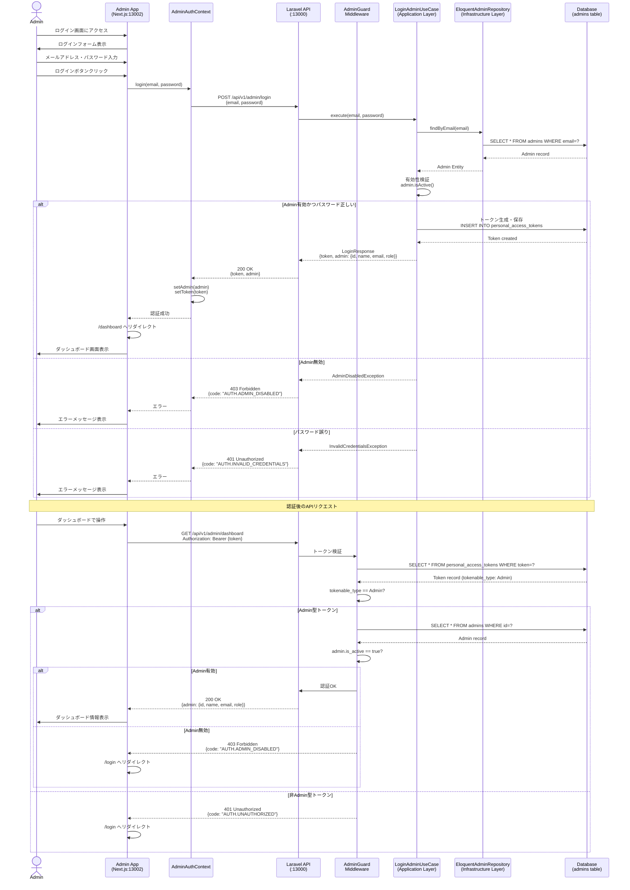
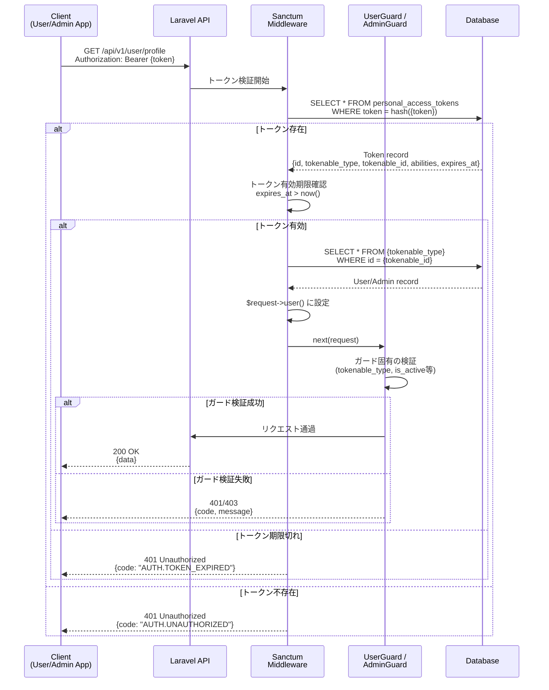
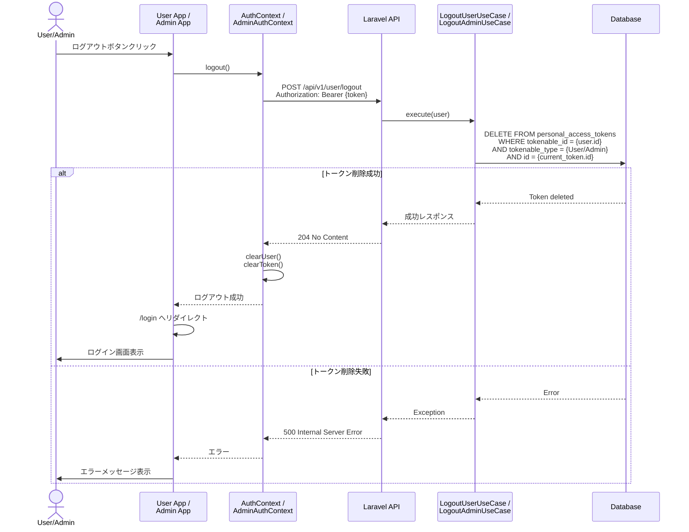
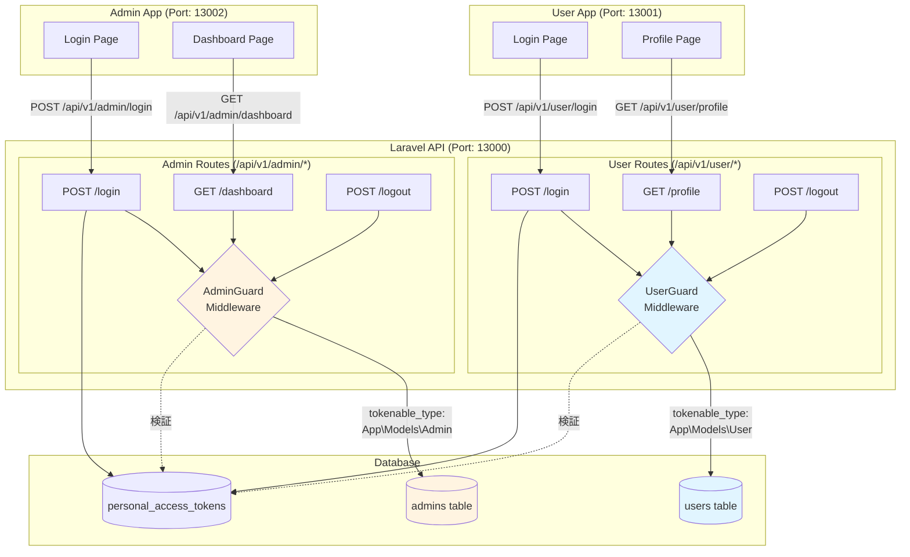

# 認証フロー図

このドキュメントでは、Laravel + Next.js B2C アプリケーションにおける User/Admin 認証フローを図示します。

## 目次

- [User 認証フロー](#user-認証フロー)
- [Admin 認証フロー](#admin-認証フロー)
- [トークン検証フロー](#トークン検証フロー)
- [ログアウトフロー](#ログアウトフロー)

---

## User 認証フロー

User App のログインから認証状態確認までの完全なフローを示します。

### フロー説明

1. **ログイン画面表示**: User が `/login` にアクセス
2. **認証情報送信**: User App が `/api/v1/user/login` に POST リクエスト
3. **認証処理**:
   - UseCase がパスワード検証
   - トークン生成（`personal_access_tokens` テーブル）
   - `tokenable_type = 'App\Models\User'` で保存
4. **認証成功**: トークンとユーザー情報を返却、`/profile` へリダイレクト
5. **認証後リクエスト**: Bearer トークンで保護された API にアクセス
6. **トークン検証**: `UserGuard` が `tokenable_type` を検証し、User 型のみ通過

---

## Admin 認証フロー

Admin App のログインから認証状態確認までの完全なフローを示します。

### フロー説明

1. **ログイン画面表示**: Admin が `/login` にアクセス
2. **認証情報送信**: Admin App が `/api/v1/admin/login` に POST リクエスト
3. **認証処理**:
   - UseCase がパスワード検証
   - **Admin 有効性検証** (`is_active = true`)
   - トークン生成（`personal_access_tokens` テーブル）
   - `tokenable_type = 'App\Models\Admin'` で保存
4. **認証成功**: トークンと管理者情報を返却、`/dashboard` へリダイレクト
5. **認証後リクエスト**: Bearer トークンで保護された API にアクセス
6. **トークン検証**: `AdminGuard` が `tokenable_type` と `is_active` を検証し、有効な Admin のみ通過

---

## トークン検証フロー

Laravel Sanctum によるトークン検証の詳細フローを示します。

### トークン検証ステップ

1. **トークンハッシュ化**: リクエストの Bearer トークンを SHA-256 でハッシュ化
2. **DB検索**: `personal_access_tokens` テーブルからトークンレコード取得
3. **有効期限確認**: `expires_at` が現在時刻より後であることを確認
4. **ユーザー取得**: `tokenable_type` と `tokenable_id` から User/Admin レコード取得
5. **ガード検証**: `UserGuard` または `AdminGuard` で追加検証
   - `UserGuard`: `tokenable_type == 'App\Models\User'`
   - `AdminGuard`: `tokenable_type == 'App\Models\Admin'` かつ `is_active == true`

---

## ログアウトフロー

User/Admin のログアウト処理フローを示します。

### ログアウト処理の特徴

1. **現在のトークンのみ削除**: ログアウト時は現在使用中のトークンのみを削除
2. **他デバイスのトークンは保持**: 他のデバイスでログインしている場合、そのトークンは無効化されない
3. **全デバイスログアウト**: 全トークン削除が必要な場合は、別エンドポイント `/api/v1/user/logout-all` を使用
4. **クライアント側のクリーンアップ**: `AuthContext` がトークンとユーザー情報をクリア

---

## ガード分離の仕組み

User と Admin のガードが完全に分離されている仕組みを図示します。

### ガード分離のポイント

1. **完全に独立したルート**: User と Admin は別の URL プレフィックスを使用
2. **専用ミドルウェア**: `UserGuard` と `AdminGuard` で `tokenable_type` を検証
3. **別テーブル**: `users` と `admins` テーブルで完全に分離
4. **トークン識別**: `personal_access_tokens.tokenable_type` でトークンの種類を識別
5. **クロスアクセス防止**: User トークンで Admin エンドポイントにアクセスすると 401 エラー

---

## セキュリティ考慮事項

### トークンストレージ

- **推奨**: HttpOnly Cookie（XSS 攻撃からトークンを保護）
- **代替**: LocalStorage（SPA の場合、CSP で XSS 対策必須）

### トークン有効期限

- **デフォルト**: 24時間（`config/sanctum.php` の `expiration`）
- **推奨**: リフレッシュトークン実装で短い有効期限を設定

### CSRF 対策

- **Sanctum ステートレストークン**: CSRF トークン不要
- **Cookie ベース認証**: `sanctum:csrf-cookie` エンドポイントで CSRF トークン取得

### レート制限

- **ログインエンドポイント**: 1分間に5回まで（`DynamicRateLimit` middleware）
- **一般エンドポイント**: 1分間に60回まで

---

## 関連ドキュメント

- [API仕様書](./API_SPECIFICATION.md)
- [APIバージョニング戦略](./API_VERSIONING_STRATEGY.md)
- [セキュリティベストプラクティス](./SECURITY_BEST_PRACTICES.md)
- [トラブルシューティングガイド](./TROUBLESHOOTING.md)
